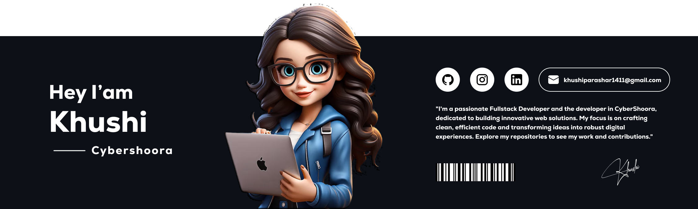

# Hello World!, I'm Khushi, a Indian Developer 👋🏼:

# 💫 About Me:
👋 About Me Hi, I'm a passionate Web Developer and UI/UX Designer who loves building modern, responsive, and user-friendly websites. I specialize in creating seamless digital experiences with clean code and creative design.  💻 Frontend: HTML, CSS, Tailwind CSS, JavaScript  🎨 UI/UX: Intuitive design, responsive layouts, and smooth user flows  🔧 Tools: Git, GitHub, Figma, VS Code  🚀 Currently exploring advanced frontend development and real-world UI projects  I enjoy turning ideas into real web experiences. Let’s build something awesome together!

## 🌐 Socials:
   

# 💻 Tech Stack:
                 
# 📊 GitHub Stats:
 
 

## 🏆 GitHub Trophies

---

<!-- Proudly created with GPRM ( https://gprm.itsvg.in ) -->
### 🔝 Top Contributed Repo

<h2>Contributions</h2>

---

<!-- Proudly created with GPRM ( https://gprm.itsvg.in ) -->

<picture>
  <source media="(prefers-color-scheme: dark)" srcset="https://raw.githubusercontent.com/tobiasmeyhoefer/tobiasmeyhoefer/output/github-snake-dark.svg" />
  <source media="(prefers-color-scheme: light)" srcset="https://raw.githubusercontent.com/tobiasmeyhoefer/tobiasmeyhoefer/output/github-snake.svg" />
  
</picture>
